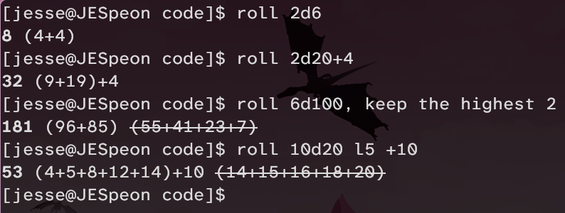

 \
Syntax: roll [dice_count]d[die_sides] 

OPTIONS: \
h(igh) # — Keep only the # highest dice. \
l(ow) # — Keep only the # lowest dice. \
+# — Add # to the total. \
-# — Subtract from the total.

Syntax is flexible: You can add spaces and full words, or just use single letters — whatever is intuitive for you. \
ie: 'h2' and 'high 2' and 'keep the highest 2' will all do the same thing. \
tldr example: roll 5d6 h2 +3 — 'Roll five 6-sided dice, keep the highest 2, add 3.'
